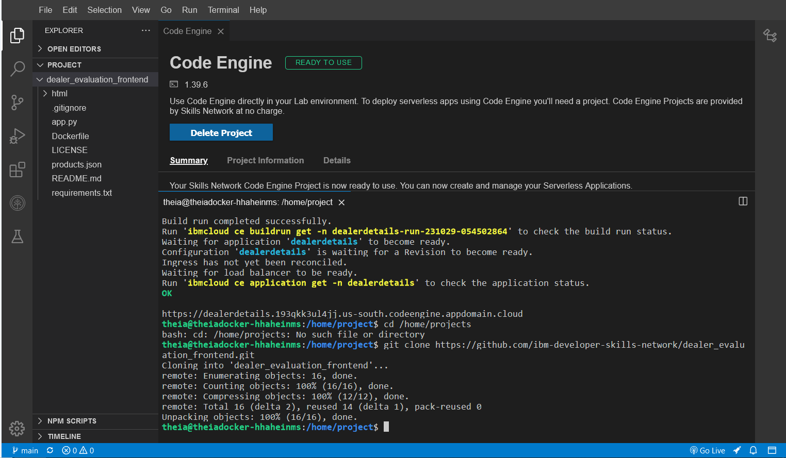

# Product Price Comparison

***code engine commands used in that project***

    1.Open the Code Engine CLI.

    2.Deploy the Product Details python application which provides API endpoints that can be used to get the products details.
    
        ibmcloud ce application create --name prodlist --image us.icr.io/${SN_ICR_NAMESPACE}/prodlist --registry-secret icr-secret --port 5000 --build-context-dir products_list --build-source https://github.com/ibm-developer-skills-network/dealer_evaluation_backend.git
    
    3.Deploy the Dealer Pricing Details Node.js application, which provides API endpoints that can be used to get the dealer pricing details.

        ibmcloud ce application create --name dealerdetails --image us.icr.io/${SN_ICR_NAMESPACE}/dealerdetails --registry-secret icr-secret --port 8080 --build-context-dir dealer_details --build-source https://github.com/ibm-developer-skills-network/dealer_evaluation_backend.git
    
    4.Deploy the frontend application by pointing the build-source to the current directory.
    
        ibmcloud ce application create --name frontend --image us.icr.io/fontend --registry-secret ic-secret -port 5001 --build-source .

1. Product Details Deployment
   

2. Dealer Details Deployment
   

3. Git Clone
   

4. Index URL Changes
   

5. Frontend Deployment
   

6. Homepage
   

7. Product Dealer
   

8. Product Dealer Price
   

9. Product All Dealers Prices
   
